# Food Ordering Web Application

 An online food ordering and delivery web platform. Users can make food orders from listed restaurants and have it delivered to their physical address. 

## Built With

* [ANGULAR 10](https://angular.io/) - Implementation of the Frontend user interfaces across all web platform.
* [Node JS](https://nodejs.org/en/) - Used to implement the backend logic: Serve API routes, application authentication and encryption of the authentication process.
* [MySql](https://dev.mysql.com/doc/) - Database implementation

## Features
* Search option to filter the restaurants
* Shopping cart
* Language translation service using [ngx-translate](https://github.com/ngx-translate/core). Translates between English and French.
* Payment options include Cash payment, M-Pesa(Incomplete), Visa/Master Card(Incomplete) 
## Frontend Walk through
### Homepage
* The landing page has a hero image with a custome welcome text and a link that takes you to the restaurant list page.
* It also has featured Menu list 

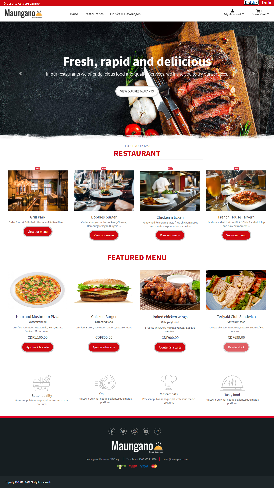

### Restaurants page

The restaurant page has all the restaurants layed out in a grid format with a filter at the top.

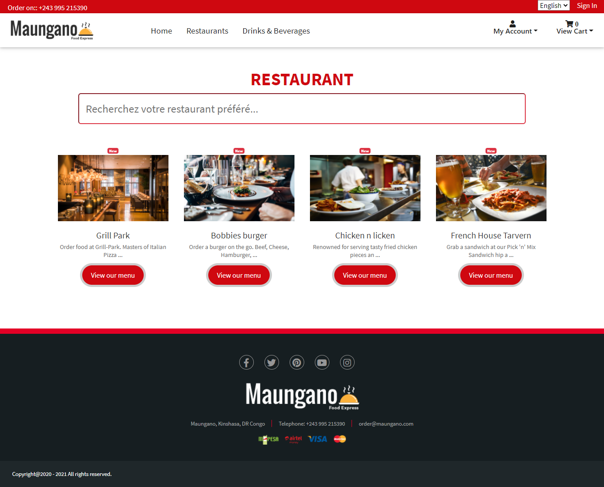

### Menu page
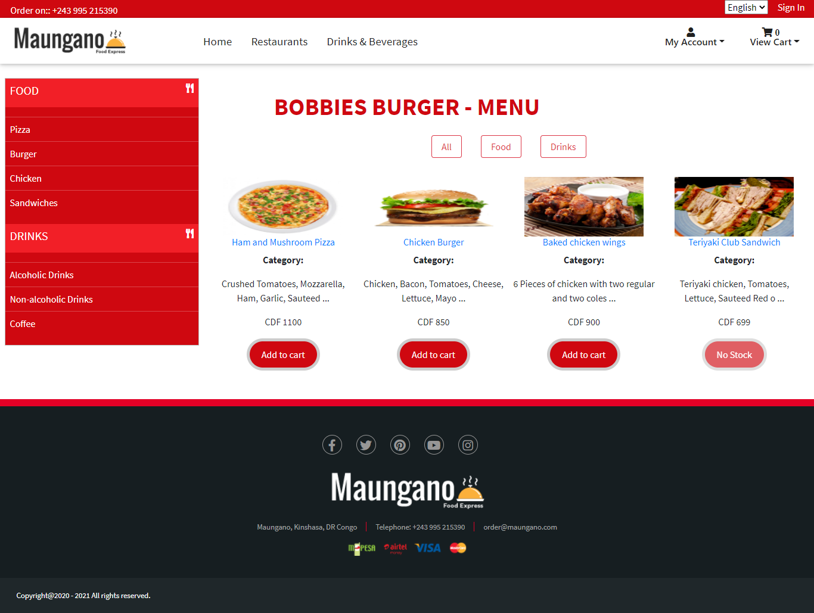

### Shopping cart
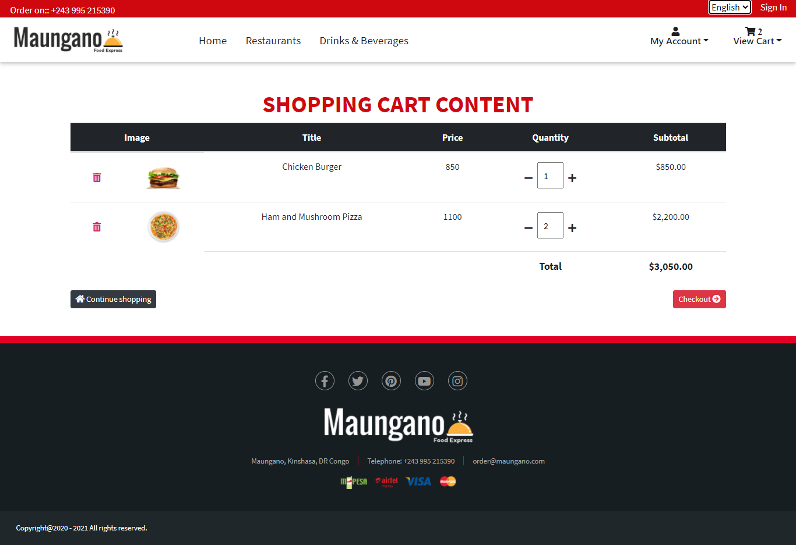

### Checkout
 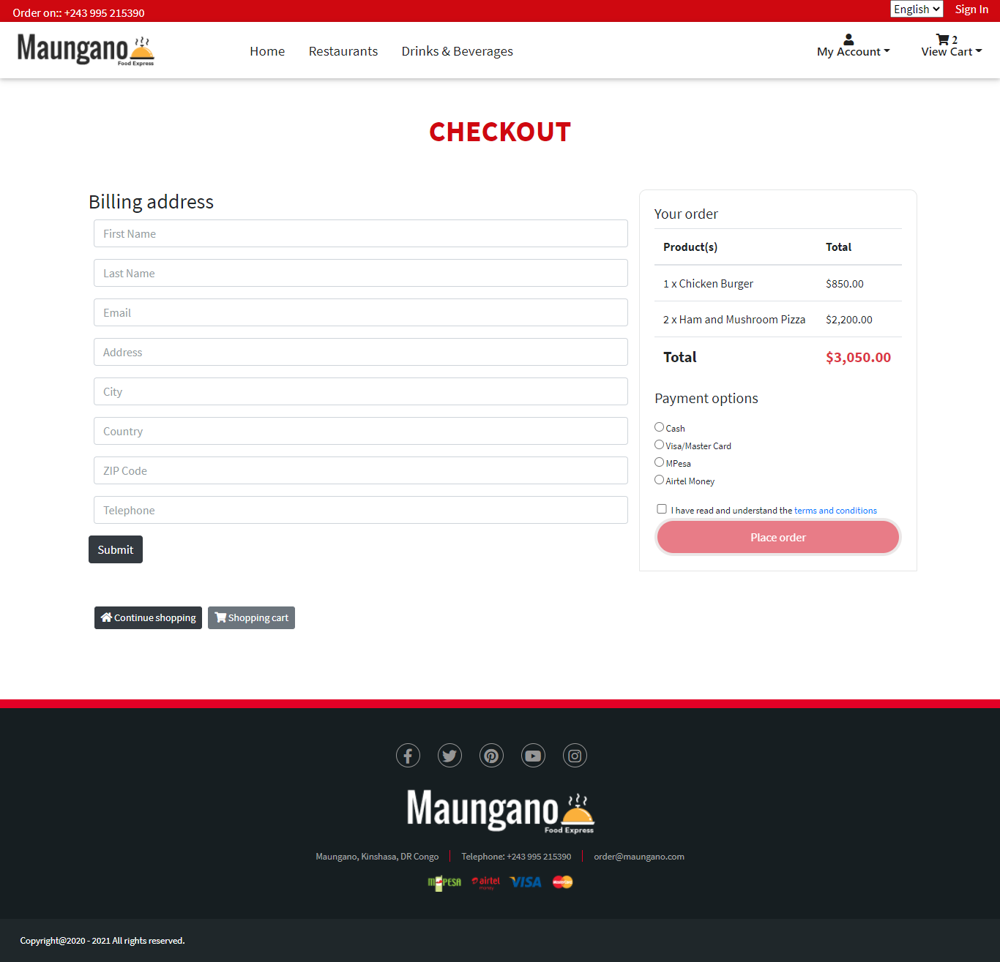

 ### Customer profile
 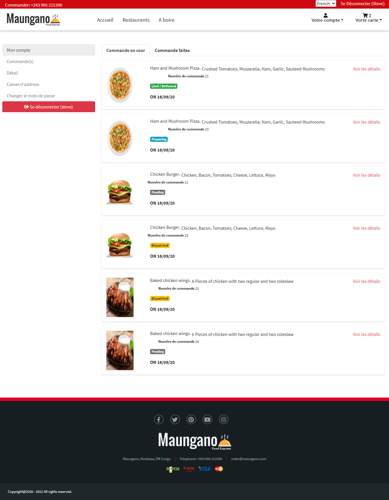

 ## Admin Dashboard 
 
The Admin dashboard has panels that allow the administrator and other authorised users to perform specified functions.

 ### Admin login
 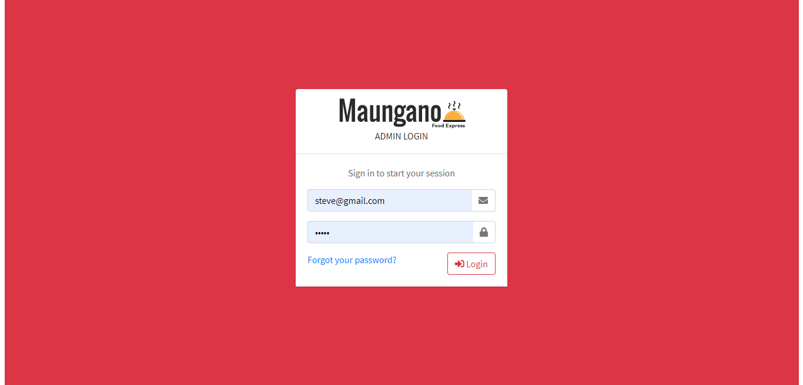

 ### Order list
 * Through this panel a user can keep track of all orders:  Incoming, dispatched, fullfilled and cancelled orders.
 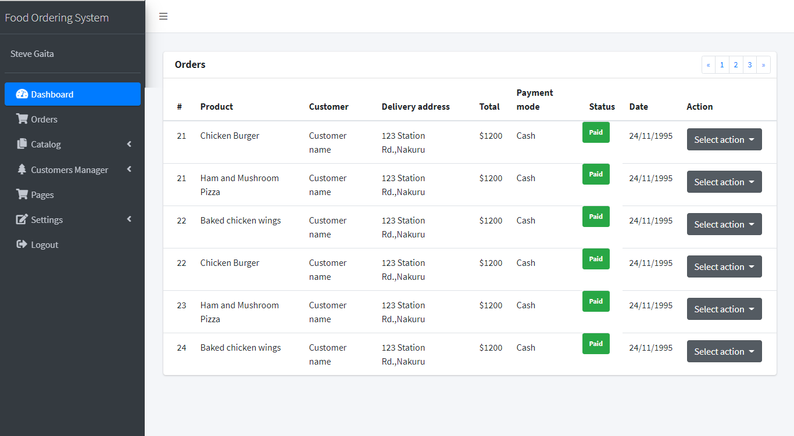

 ### Restaurants Manager

 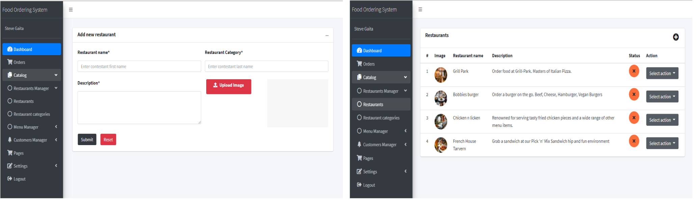

 ### Menu Manager

 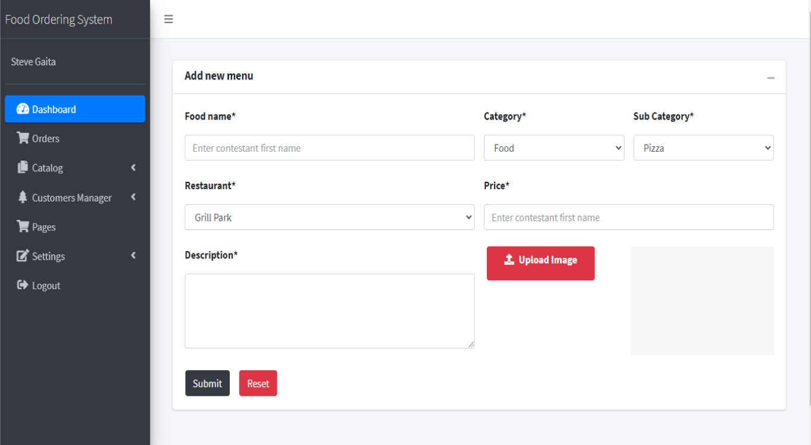

 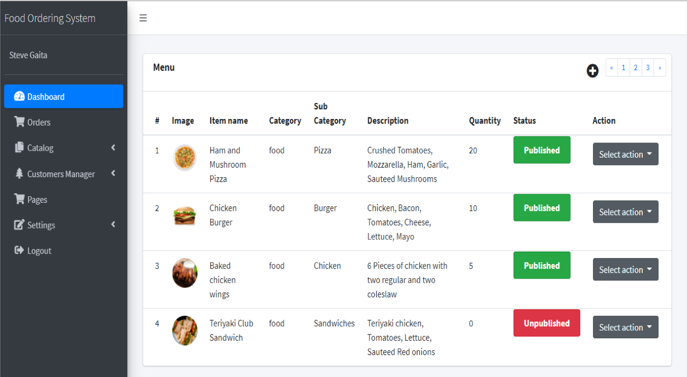

## Payment Gateways

This application implements the following payments gateways:

* M-PESA - [INCOMPLETE] This is implemented using the [M-Pesa Library for Node JS ](https://github.com/safaricom/mpesa-node-library), that exposes M-Pesa API by Safaricom.
* Stripe - [INCOMPLETE] The Stripe Node library provides convenient access to the [Stripe API](https://github.com/stripe/stripe-node) that allows collecting customer and payment information made using VISA/ Mastercard.

## Mobile platform
*  A [mobile app](https://github.com/SGGaita/food-ordering-app) is currenty under development using [React Native](https://reactnative.dev/docs/getting-started)
  
